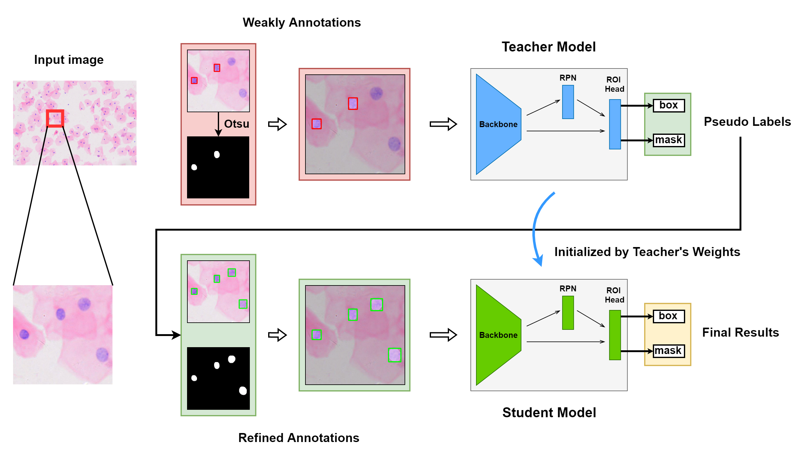
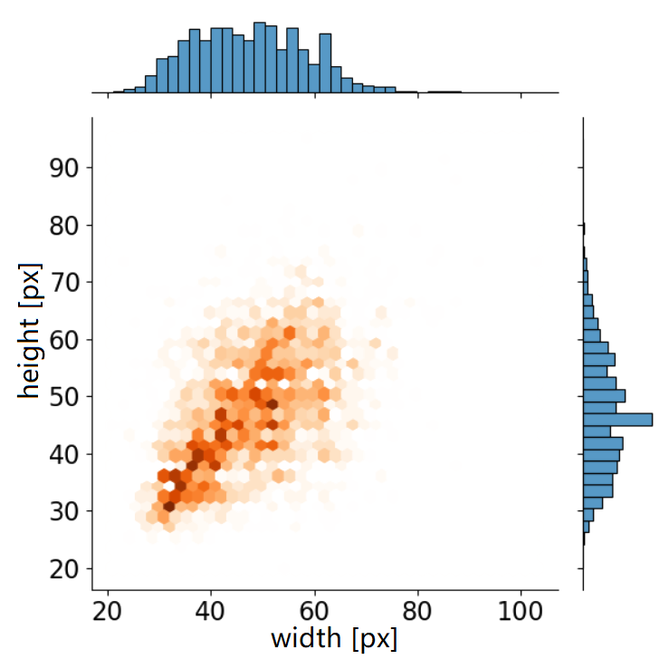

## Weakly Supervised Deep Nuclei Segmentation with Sparsely Annotated Bounding Boxes for DNA Ploidy Analysis

This code is based on [mmdetection](https://github.com/open-mmlab/mmdetection).



### Datasets

The dataset, which has more than 1000,000 nuclei in 23,485 images, was cropped from the Feulgen stained Whole Slide Images (WSIs). The number of targets in each image is distributed around 40, and the maximum number is 327. Compared to general datasets, the average number of targets per image is relatively large while the scale of targets is mainly concentrated below 32 × 32, which is a small size for the feature extractor block.



This datasets is available on google driver [here](https://drive.google.com/drive/folders/1xOhPszjY2vKIsp9JH_Kgdc8IZfilY4WY?usp=sharing).

### Environment

-   CUDA==10.1
-   python=3.7
-   pytorch==1.7.0
-   mmdet==2.16.0
-   mmcv-full==1.3.8

### Prepare Environment

```
conda create -n mmdet-dna python=3.7 -y
conda activate mmdet-dna

conda install pytorch==1.7.0 torchvision==0.8.0 torchaudio==0.7.0 cudatoolkit=10.1 -c pytorch -y
pip install mmcv-full==1.3.8  -f https://download.openmmlab.com/mmcv/dist/cu101/torch1.7.0/index.html -i https://pypi.douban.com/simple/

cd mmdetection-dna
pip install -r requirements/build.txt -i https://pypi.douban.com/simple/
pip install -v -e .  -i https://pypi.douban.com/simple/

pip install tqdm -i https://pypi.douban.com/simple/
pip install scikit-image -i https://pypi.douban.com/simple/
```

### Training

```
# teacher model
tools/dist_train.sh configs/_dna_/mask_rcnn_r50_fpn_32k_coco-dna.py 4

# label refinement
config=mask_rcnn_r50_fpn_32k_coco-dna
tools/dist_test.sh configs/_dna_/$config.py work_dirs/$config/iter_16000.pth 4 --train --format-only

tools/dist_test_gt.sh configs/_dna_/$config.py work_dirs/$config/iter_16000.pth 4 --format-only
tools/update_gt.py /path/to/train_otsu.json work_dirs/$config/iter_16000_gt.segm.json -j 8

tools/test_pseudo.py configs/_dna_/$config.py work_dirs/$config/iter_16000.pth --format-only --ann work_dirs/$config/iter_16000_gt.ann.json --thresh 0.75 -j 8

# student model
tools/dist_train.sh configs/_dna_/mask_rcnn_r50_fpn_32k_coco-dna-ft.py 4
```

### Testing

```
# evalute
tools/dist_test.sh configs/_dna_/mask_rcnn_r50_fpn_32k_coco-dna.py /path/to/iter_32000.pth 4 --eval bbox

# predict mask
python demo/test_dna_mask.py configs/_dna_/mask_rcnn_r50_fpn_32k_coco-dna.py /path/to/iter_32000.pth --input /path/to/train/JPEGImages_other --output ./output_mask
```

The pretrained weights are available at this [link](https://drive.google.com/file/d/1EvRXDEhBrw0WmmCAMaoU2YsCGTWZ2AF8/view?usp=sharing).
